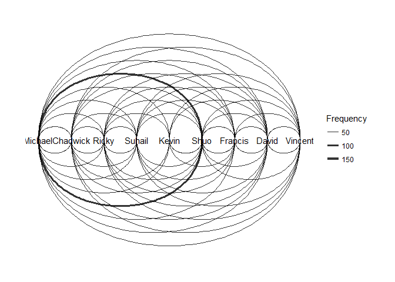

```r
#Guide: https://www.jessesadler.com/post/network-analysis-with-r/

library(tidyverse)
```

```
## Warning: package 'tidyverse' was built under R version 3.3.3
```

```
## -- Attaching packages ---------------------------------- tidyverse 1.2.1 --
```

```
## v ggplot2 2.2.1     v purrr   0.2.4
## v tibble  1.4.2     v dplyr   0.7.4
## v tidyr   0.8.0     v stringr 1.2.0
## v readr   1.1.1     v forcats 0.2.0
```

```
## Warning: package 'ggplot2' was built under R version 3.3.3
```

```
## Warning: package 'tibble' was built under R version 3.3.3
```

```
## Warning: package 'tidyr' was built under R version 3.3.3
```

```
## Warning: package 'readr' was built under R version 3.3.3
```

```
## Warning: package 'purrr' was built under R version 3.3.3
```

```
## Warning: package 'dplyr' was built under R version 3.3.3
```

```
## Warning: package 'stringr' was built under R version 3.3.3
```

```
## Warning: package 'forcats' was built under R version 3.3.3
```

```
## -- Conflicts ------------------------------------- tidyverse_conflicts() --
## x dplyr::filter() masks stats::filter()
## x dplyr::lag()    masks stats::lag()
```

```r
node_list <- tibble( name = c("Michael", "Chadwick", "Ricky", "Suhail", "Kevin", "Shuo", "Francis", "David", "Vincent"))
node_list
```

```
## # A tibble: 9 x 1
##   name    
##   <chr>   
## 1 Michael 
## 2 Chadwick
## 3 Ricky   
## 4 Suhail  
## 5 Kevin   
## 6 Shuo    
## 7 Francis 
## 8 David   
## 9 Vincent
```

```r
nodes <- add_column(node_list, id = 1:nrow(node_list)) %>% 
  select(id, everything())

nodes
```

```
## # A tibble: 9 x 2
##      id name    
##   <int> <chr>   
## 1     1 Michael 
## 2     2 Chadwick
## 3     3 Ricky   
## 4     4 Suhail  
## 5     5 Kevin   
## 6     6 Shuo    
## 7     7 Francis 
## 8     8 David   
## 9     9 Vincent
```

```r
edge_list <- read_csv("C:/Users/Gateway/Desktop/Dropbox/Data Science/Fake.csv", skip = 0,col_names = TRUE)
```

```
## Parsed with column specification:
## cols(
##   Target = col_character(),
##   Source = col_character()
## )
```

```r
edge_list
```

```
## # A tibble: 1,498 x 2
##    Target  Source 
##    <chr>   <chr>  
##  1 Michael Michael
##  2 Michael Michael
##  3 Michael Michael
##  4 Michael Shuo   
##  5 Shuo    Shuo   
##  6 Shuo    Michael
##  7 Michael Shuo   
##  8 Shuo    David  
##  9 David   Shuo   
## 10 Shuo    Michael
## # ... with 1,488 more rows
```

```r
df.fake = data.frame(edge_list)

per_msg <- df.fake %>%  
  group_by(Target, Source) %>%
  summarise(weight = n()) %>% 
  ungroup()
per_msg
```

```
## # A tibble: 69 x 3
##    Target   Source   weight
##    <chr>    <chr>     <int>
##  1 Chadwick Chadwick      4
##  2 Chadwick David         6
##  3 Chadwick Kevin         1
##  4 Chadwick Michael       8
##  5 Chadwick Ricky         5
##  6 Chadwick Shuo          2
##  7 Chadwick Suhail        4
##  8 Chadwick Vincent       2
##  9 David    Chadwick      5
## 10 David    David        26
## # ... with 59 more rows
```

```r
edges <- per_msg %>% 
  left_join(nodes, by = c("Source" = "name")) %>% 
  rename(from = id)

edges <- edges %>% 
  left_join(nodes, by = c("Target" = "name")) %>% 
  rename(to = id)

edges <- select(edges, from, to , weight)
edges
```

```
## # A tibble: 69 x 3
##     from    to weight
##    <int> <int>  <int>
##  1     2     2      4
##  2     8     2      6
##  3     5     2      1
##  4     1     2      8
##  5     3     2      5
##  6     6     2      2
##  7     4     2      4
##  8     9     2      2
##  9     2     8      5
## 10     8     8     26
## # ... with 59 more rows
```


```r
library(igraph)
```

```
## Warning: package 'igraph' was built under R version 3.3.3
```

```
## 
## Attaching package: 'igraph'
```

```
## The following objects are masked from 'package:dplyr':
## 
##     as_data_frame, groups, union
```

```
## The following objects are masked from 'package:purrr':
## 
##     compose, simplify
```

```
## The following object is masked from 'package:tidyr':
## 
##     crossing
```

```
## The following object is masked from 'package:tibble':
## 
##     as_data_frame
```

```
## The following objects are masked from 'package:stats':
## 
##     decompose, spectrum
```

```
## The following object is masked from 'package:base':
## 
##     union
```

```r
# create the network object
network=graph_from_data_frame(d=df.fake, directed=T)
network
```

```
## IGRAPH 2019136 DN-- 9 1498 -- 
## + attr: name (v/c)
## + edges from 2019136 (vertex names):
##  [1] Michael ->Michael  Michael ->Michael  Michael ->Michael 
##  [4] Michael ->Shuo     Shuo    ->Shuo     Shuo    ->Michael 
##  [7] Michael ->Shuo     Shuo    ->David    David   ->Shuo    
## [10] Shuo    ->Michael  Michael ->Michael  Michael ->Shuo    
## [13] Shuo    ->Ricky    Ricky   ->Shuo     Shuo    ->Shuo    
## [16] Shuo    ->David    David   ->Shuo     Shuo    ->Shuo    
## [19] Shuo    ->Francis  Francis ->Francis  Francis ->Francis 
## [22] Francis ->Chadwick Chadwick->Vincent  Vincent ->Suhail  
## + ... omitted several edges
```

```r
# plot it
plot(network,edge.arrow.size = .01)
```

<!-- -->


```r
library(tidygraph)
```

```
## Warning: package 'tidygraph' was built under R version 3.3.3
```

```
## 
## Attaching package: 'tidygraph'
```

```
## The following object is masked from 'package:igraph':
## 
##     groups
```

```
## The following object is masked from 'package:stats':
## 
##     filter
```

```r
library(ggraph)
```

```
## Warning: package 'ggraph' was built under R version 3.3.3
```

```r
msg <- tbl_graph(nodes = nodes, edges = edges, directed = TRUE)
class(msg)
```

```
## [1] "tbl_graph" "igraph"
```

```r
msg
```

```
## # A tbl_graph: 9 nodes and 69 edges
## #
## # A directed multigraph with 1 component
## #
## # Node Data: 9 x 2 (active)
##      id name    
##   <int> <chr>   
## 1     1 Michael 
## 2     2 Chadwick
## 3     3 Ricky   
## 4     4 Suhail  
## 5     5 Kevin   
## 6     6 Shuo    
## # ... with 3 more rows
## #
## # Edge Data: 69 x 3
##    from    to weight
##   <int> <int>  <int>
## 1     2     2      4
## 2     8     2      6
## 3     5     2      1
## # ... with 66 more rows
```

```r
#ggplot
ggraph(msg) + geom_edge_link() + geom_node_point() + theme_graph()
```

```
## Using `nicely` as default layout
```

<!-- -->

```r
ggraph(msg, layout = "graphopt") + 
  geom_node_point() +
  geom_edge_link(aes(width = weight), alpha = 0.8) + 
  scale_edge_width(range = c(0.2, 2)) +
  geom_node_text(aes(label = name), repel = TRUE) +
  labs(edge_width = "Frequency") +
  theme_graph()
```

```
## Warning in grid.Call(L_textBounds, as.graphicsAnnot(x$label), x$x, x$y, :
## font family not found in Windows font database
```

```
## Warning in grid.Call(L_textBounds, as.graphicsAnnot(x$label), x$x, x$y, :
## font family not found in Windows font database
```

```
## Warning in grid.Call.graphics(L_text, as.graphicsAnnot(x$label), x$x, x
## $y, : font family not found in Windows font database

## Warning in grid.Call.graphics(L_text, as.graphicsAnnot(x$label), x$x, x
## $y, : font family not found in Windows font database
```

<!-- -->

```r
ggraph(msg, layout = "linear") + 
  geom_edge_arc(aes(width = weight), alpha = 0.8) + 
  scale_edge_width(range = c(0.2, 2)) +
  geom_node_text(aes(label = name)) +
  labs(edge_width = "Frequency") +
  theme_graph()
```

```
## Warning in grid.Call(L_textBounds, as.graphicsAnnot(x$label), x$x, x$y, :
## font family not found in Windows font database
```

```
## Warning in grid.Call(L_textBounds, as.graphicsAnnot(x$label), x$x, x$y, :
## font family not found in Windows font database
```

```
## Warning in grid.Call.graphics(L_text, as.graphicsAnnot(x$label), x$x, x
## $y, : font family not found in Windows font database

## Warning in grid.Call.graphics(L_text, as.graphicsAnnot(x$label), x$x, x
## $y, : font family not found in Windows font database
```

<!-- -->


```r
library(ggplot2)
ggplot(data = per_msg, aes(x=Target, y=Source, fill=weight)) + 
  geom_tile()
```

<!-- -->


