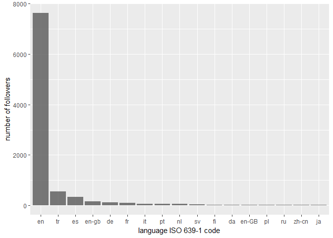
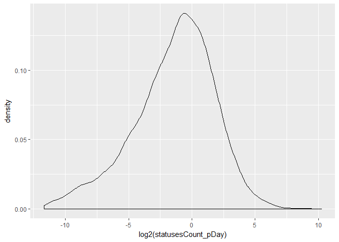
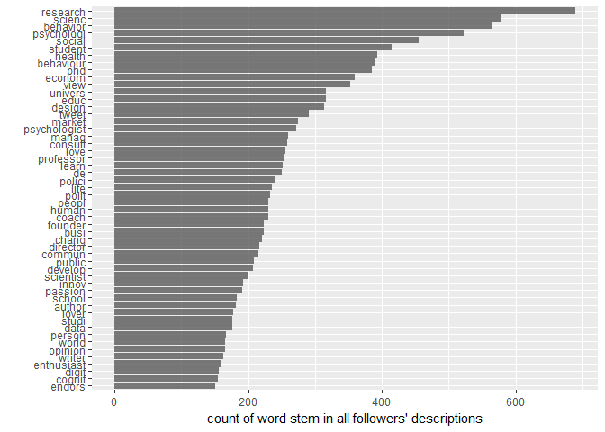
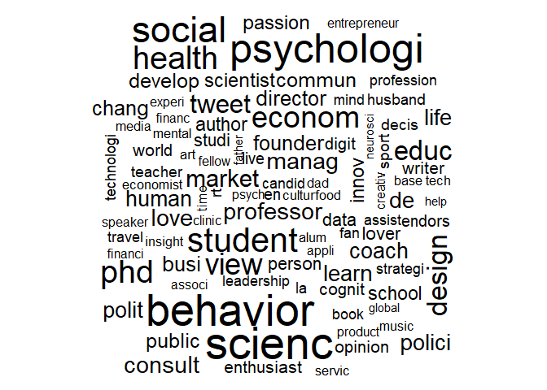

```r
library(tidyverse)
```

```
## -- Attaching packages ---------------------------------------------------------------------------------- tidyverse 1.2.1 --
```

```
## v ggplot2 2.2.1     v purrr   0.2.4
## v tibble  1.4.2     v dplyr   0.7.4
## v tidyr   0.8.0     v stringr 1.2.0
## v readr   1.1.1     v forcats 0.2.0
```

```
## Warning: package 'ggplot2' was built under R version 3.4.4
```

```
## -- Conflicts ------------------------------------------------------------------------------------- tidyverse_conflicts() --
## x dplyr::filter() masks stats::filter()
## x dplyr::lag()    masks stats::lag()
```

```r
library(ggplot2)
library(twitteR)
```

```
## Warning: package 'twitteR' was built under R version 3.4.4
```

```
## 
## Attaching package: 'twitteR'
```

```
## The following objects are masked from 'package:dplyr':
## 
##     id, location
```

```r
library(tidytext)
```

```
## Warning: package 'tidytext' was built under R version 3.4.4
```

```r
library(SnowballC)
library(wordcloud)
```

```
## Warning: package 'wordcloud' was built under R version 3.4.4
```

```
## Loading required package: RColorBrewer
```

```r
library(tm)
```

```
## Warning: package 'tm' was built under R version 3.4.4
```

```
## Loading required package: NLP
```

```
## 
## Attaching package: 'NLP'
```

```
## The following object is masked from 'package:ggplot2':
## 
##     annotate
```

```r
setup_twitter_oauth(api_key,api_secret)
```

```
## [1] "Using browser based authentication"
```

```r
tweets <- userTimeline("behscientist", n = 9999)
```

```
## Warning in statusBase(cmd, params, n, 3200, ...): statuses/user_timeline
## has a cap of 3200 statuses, clipping
```

```r
user <- getUser("behscientist")

friends <- user$getFriends() # who this user follows
followers <- user$getFollowers() # this user's followers
followers2 <- followers[[1]]$getFollowers() # a follower's followers

head(followers)
```

```
## $`2445893964`
## [1] "_tarantoc"
## 
## $`810655639`
## [1] "walterwgodinez"
## 
## $`212287084`
## [1] "elliottjim"
## 
## $`6606932`
## [1] "sspxs"
## 
## $`3115038935`
## [1] "MattEagle09"
## 
## $`890222586134761472`
## [1] "clvnmllr"
```

```r
#Source : https://shiring.github.io/text_analysis/2017/06/28/twitter_post

followers_df <- twListToDF(followers)


head(followers_df$description)
```

```
## [1] ""                                                                                                                                                                                                       
## [2] "Continuous Improvement @ Toyota l New York University Alum l Focus areas: Productivity + Teams"                                                                                                         
## [3] "Investigating trauma/recovery in, with, & beyond @NthSydHealth & @USydFHS | #DontTextAndDrive | #DontDrinkAndDrive | #MRI | caught a few baseballs"                                                     
## [4] "Economista @UPCEdu, PAE en RSE y Sostenibilidad @ESANPeru, Voluntario en acción y pasión | Desde donde me toque, trabajando por el desarrollo del país <ed><U+00A0><U+00BD><ed><U+00B2><U+00AA><ed><U+00A0><U+00BC><ed><U+00BF><U+00BC><ed><U+00A0><U+00BC><ed><U+00B7><U+00B5><ed><U+00A0><U+00BC><ed><U+00B7><U+00AA>"
## [5] "Postdoctoral researcher, Data Archive for the Social Sciences, GESIS - Leibniz-Institute for the Social Sciences"                                                                                       
## [6] ""
```


```r
followers_df %>%
  count(lang) %>%
  filter(n > 10) %>%
  droplevels() %>%
  ggplot(aes(x = reorder(lang, desc(n)), y = n)) +
  geom_bar(stat = "identity", alpha = 0.8) +
  labs(x = "language ISO 639-1 code",
       y = "number of followers")
```

<!-- -->

```r
followers_df %>%
  mutate(date = as.Date(created, format = "%Y-%m-%d"),
         today = as.Date("2017-06-07", format = "%Y-%m-%d"),
         days = as.numeric(today - date),
         statusesCount_pDay = statusesCount / days) %>%
  ggplot(aes(x = log2(statusesCount_pDay))) +
  geom_density( alpha = 0.8) 
```

```
## Warning in fun(x, ...): NaNs produced
```

```
## Warning in FUN(X[[i]], ...): NaNs produced
```

```
## Warning: Removed 731 rows containing non-finite values (stat_density).
```

<!-- -->


```r
tidy_descr <- followers_df %>%
  unnest_tokens(word, description) %>%
  mutate(word_stem = wordStem(word)) %>%
  anti_join(stop_words, by = "word") %>%
  filter(!grepl("\\.|http", word))

tidy_descr %>%
  count(word_stem, sort = TRUE) %>%
  filter(n > 150) %>%
  ggplot(aes(x = reorder(word_stem, n), y = n)) +
  geom_col( alpha = 0.8) +
  coord_flip() +
  labs(x = "",
       y = "count of word stem in all followers' descriptions")
```

<!-- -->

```r
tidy_descr %>%
  count(word_stem) %>%
  mutate(word_stem = removeNumbers(word_stem)) %>%
  with(wordcloud(word_stem, n, max.words = 100))
```

```
## Warning in wordcloud(word_stem, n, max.words = 100): research could not be
## fit on page. It will not be plotted.
```

```
## Warning in wordcloud(word_stem, n, max.words = 100): psychologist could not
## be fit on page. It will not be plotted.
```

```
## Warning in wordcloud(word_stem, n, max.words = 100): behaviour could not be
## fit on page. It will not be plotted.
```

```
## Warning in wordcloud(word_stem, n, max.words = 100): univers could not be
## fit on page. It will not be plotted.
```

```
## Warning in wordcloud(word_stem, n, max.words = 100): peopl could not be fit
## on page. It will not be plotted.
```

<!-- -->


