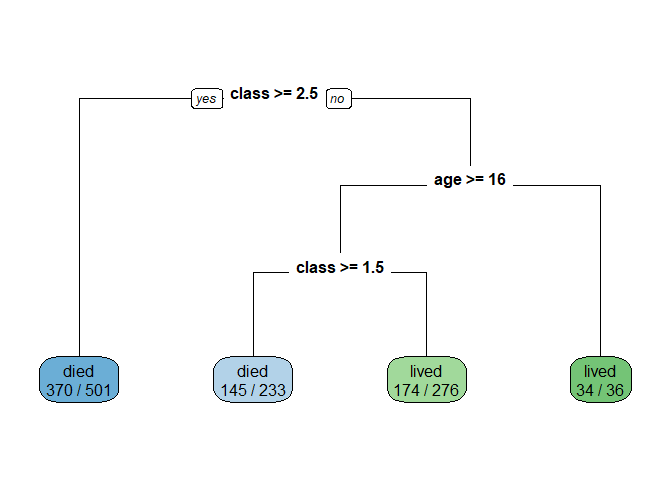
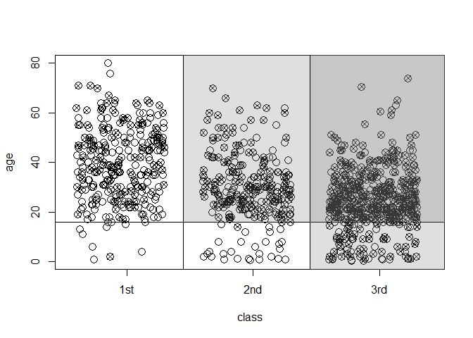

>  data is from http://biostat.mc.vanderbilt.edu/wiki/Main/DataSets


```r
library(readr)
```

```
## Warning: package 'readr' was built under R version 3.3.3
```

```r
titanic3 <- read_csv("C:/Users/Gateway/Desktop/titanic3.csv")
```

```
## Parsed with column specification:
## cols(
##   pclass = col_integer(),
##   survived = col_integer(),
##   name = col_character(),
##   sex = col_character(),
##   age = col_double(),
##   sibsp = col_integer(),
##   parch = col_integer(),
##   ticket = col_character(),
##   fare = col_double(),
##   cabin = col_character(),
##   embarked = col_character(),
##   boat = col_character(),
##   body = col_integer(),
##   home.dest = col_character()
## )
```

```r
 dat <- titanic3
# remove missing data and extract variables
titanic <- na.omit(dat[,c("survived","pclass","sex","age","sibsp")])
 survived <- titanic$survived
 surv <- survived
 surv[surv==0] <- "died"
 surv[surv==1] <- "lived"
 age <- titanic$age
 class <- titanic$pclass
```
 

```r
 dat <- titanic3
 # remove missing data and extract variables
titanic <- na.omit(dat[,c("survived","pclass","sex","age","sibsp")])
 survived <- titanic$survived
 surv <- survived
 surv[surv==0] <- "died"
 surv[surv==1] <- "lived"
 age <- titanic$age
 class <- titanic$pclass
```


```r
 # fit a simple tree
 library("rpart")
 model.rpart <- rpart(surv ~ class + age)
 model.prune <- prune(model.rpart,cp=.038)
```


```r
 # plot it
 library("rpart.plot")
```

```
## Warning: package 'rpart.plot' was built under R version 3.3.3
```

```r
 rpart.plot(model.prune,type=0,extra=2)
```

<!-- -->


```r
 # partition plot (Figure 2 in paper)
 n <- length(class)
 class.jitter <- class+.7*runif(n)
 plot(age ~ class.jitter,xlim=c(.95,3.8),cex=1.5,xlab="class",xaxt="n")
 axis(side=1,at=c(1.4,2.4,3.4),label=c("1st","2nd","3rd"))
 abline(v=1.85)
 abline(v=2.85)
 abline(h=16)
 points(age[survived==0] ~ class.jitter[survived==0],pch=4)
 rect(1.85,16,4.0,89,col=rgb(0.5,0.5,0.5,1/4))
 rect(2.85,-5,4.0,89,col=rgb(0.5,0.5,0.5,1/4))
```

<!-- -->
 

